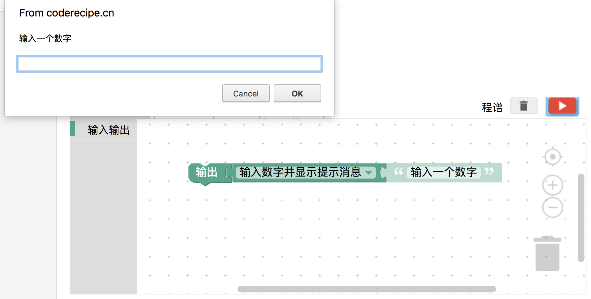
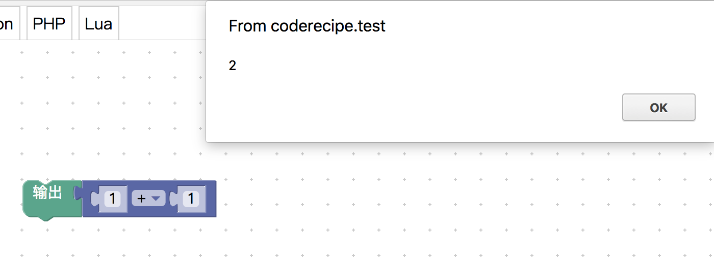

<notice>教程读者请不要直接阅读本文件，因为诸多功能在此无法正常使用，请移步至[程谱 coderecipe.cn](https://coderecipe.cn/learn/1)学习完整教程。如果您喜欢我们的教程，请在右上角给我们一个“Star”，谢谢您的支持！</notice>
初入编程
======

欢迎来到程谱社区！😁 我们是一群留学生，致力于搭建一个系统而又不枯燥的零基础入门编程学习平台。希望大家能多多支持我们，如果发现我们的不足之处也欢迎联系我们~

这是大多数程谱学员的第一个教程，从这里开始学习吧！💖

输入&输出
------
如果你是在用电脑阅读这个教程，那么你就正在盯着电脑的显示屏看，偶尔还会滚动一下鼠标滚轮🖱。如果你用的是手机或者平板📱，那么就会通过触摸屏上下滑动网页来阅读教程的内容。

你可能没有注意到，但仔细想想就会发现，我们身边的电子设备大多都可以由我们操控（输入）和告诉我们信息（输出），不只是电脑手机和平板，例如电话☎️能接收和发出声音。思考到这一步，你就已经理解了输入(input)和输出(output)这两个概念了。

之前说的是广义的输入和输出，而对于计算机程序的运行来说，我们先给程序提供必要的数据信息（输入），然后程序进行一系列的运算，再把结果告诉我们（输出），就像下面这张图画的这样：

掌握了吗？如果掌握了，就按一下右下方这个按钮吧~

练习环境小热身
------
下面是练习框，让我们跟着练习框的下方的指示一起来熟悉一下练习环境吧。

<lab lang="blocks" parameters="logic=false&math=false&loops=false&lists=false&color=false&variables=false&functions=false&text=false&name=chapter1lab1">
  <notice>练习环境在此无法显示，请移步至[程谱 coderecipe.cn](https://coderecipe.cn/learn/1)查看。</notice>
</lab>

首先，点击左边的“输入输出”，将“输出”块拖到右边。然后，修改一下文字“abc”成“Hello World!”，再点击右边的红色按钮运行。
结果应该是这样：

那输入呢？ 让我们把“输入文字并提示消息”块插到“输出”块上，这里的提示消息指的是在输入文字的时候会告诉我们程序的使用者输入的文字的含义，同样点击运行，首先输入一些文字，然后点确认，这串文字就会被输出了。当然，我们也可以通过下拉框选择让这个输入块读取数字，试一试吧。

如果想删除一个块，把它拖到右下角的垃圾桶图标上就好了。

细心的你可能会发现，在选择输入数字以后，如果输入的不是一个数字，就会输出NaN，这是为什么呢？其实NaN的意思是Not a Number，代表程序告诉我们输入的并不是一个数字。

这样，我们就做出了一个小程序，它能读取用户的输入，然后对数字进行处理，然后输出回来，是不是很有意思呀~

计算
------
刚才我们学完了最基本的输入输出，那接下来我们可以更进一步，学一下如何让计算机来为我们进行运算。

<lab lang="blocks" parameters="logic=false&loops=false&lists=false&color=false&variables=false&functions=false&text=false&name=chapter1lab2">
  <notice>练习环境在此无法显示，请移步至[程谱 coderecipe.cn](https://coderecipe.cn/learn/1)查看。</notice>
</lab>

你可能会发现，这个练习环境和之前不一样，因为这里多了一个“数学”按钮，点进去以后会发现里面全都是数学运算，看起来好复杂的样子。让我们从简单的开始，先拖动一个“1+1”块（其实这是四则运算加乘方块，我们等一会儿就知道啦），插在“输出”块上，点击运行，大功告成啦！

这个“1+1”块可没有看起来那么简单，这个块是可是可以高度定制的呢！我们可以1+1成为任意的四则运算内容，比如10÷5。而且这个“1+1”块内部还可以嵌入其他块，这样就可以做好多次加减乘除啦。

我们还可以把输入块放入这个运算块里，不过记得选择“输入数字并显示消息”而不是“输入文字并显示消息”，不然是放不进运算块的，毕竟文字可不能进行四则运算。

像底下这样组合块就可以做出一个除法计算器啦！

小练习
------
让我们来练习一下我们刚学习的知识吧。
<lab lang="blocks" parameters="logic=false&loops=false&lists=false&color=false&variables=false&functions=false&text=false&name=chapter1lab3">
  <notice>练习环境在此无法显示，请移步至[程谱 coderecipe.cn](https://coderecipe.cn/learn/1)查看。</notice>
</lab>

试试做出如下的效果：

1. 输出“我要认真学习编程” （不带引号）
2. 计算1000-985并输出
3. 计算(100-58)\*2并输出
4. 把输入的数值加上10输出
5. 把输入的数值平方（也就是四则运算加乘方块里面的^2）输出

学到这里，你就已经算是入门计算机编程啦👏，加油加油继续学习吧~
