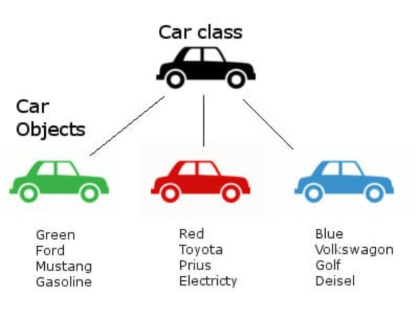

<notice>教程读者请不要直接阅读本文件，因为诸多功能在此无法正常使用，请移步至[程谱 coderecipe.cn](https://coderecipe.cn/learn/1)学习完整教程。如果您喜欢我们的教程，请在右上角给我们一个“Star”，谢谢您的支持！</notice>

类和对象
======

欢迎来到程谱Java面向对象教程第一章节——类和对象😁

类和对象是Java面向对象编程中的思想基础。深入理解类和对象的概念并且熟练掌握其应用将为你的Java学习打下坚实的基础。

开始学习吧！💖

什么是类
------
在现实生活中，我们能见到非常多的“归类”例子，例如，喜鹊、麻雀、乌鸦、燕子等等都属于鸟类，而狮子、老虎、家猫等等都属于猫科动物。在这样的例子中，“鸟类”、“猫科动物”都定义了一个类(class)。

类(class）是定义同一类所有对象的变量和方法的蓝图或原型，描述了所创建的对象共同的属性（状态）和方法（行为）。换言之，类是一个模板，它描述一类对象的行为和状态。

而各种具体的动物（比如某一只猫），则是属于各自类别的一个个实例（instance），也叫对象（object），在后面几节我们会细讲。



由此图可见，从左至右的三辆车各有独自的属性（状态）：颜色、厂家、品牌、动力类型，等等。但他们都作为对象（object）共同属于“车（Car）”这个类。

类的定义方法很简单，如下：
```java
public class 类名 {
  类的内容
}
```

之后在介绍继承的时候我们还会介绍extends关键字，这里我们先记下最简单的用法。

我们这个教程里面的类，无特殊说明，指的都是公有类（public class），对于私有类我们不需要掌握。

属性和方法
------

### 属性
属性（property）是一种变量，只不过这种变量不定义在函数内部，而是定义在整个类里，整个类内都可以访问。定义方式和之前在函数内定义变量的方式差别不大，只不过属性多了一个可选的关键字，等看到本章的“作用域和三个关键字”你就明白了。这个Car类的属性如`fuel`，`maxspeed`等等就属于属性。

### 方法
方法（method）其实就是函数（function），它可以指导一个类中的对象如何执行具体的行为动作，不过一般如果我们想强调这个函数在一个类里面的作用，我们就会用“方法”这个词，比如`refuel()`就是用来操作这些属性的方法。我们还可以用过参数来告诉这个函数具体的内容，比如`setSpeed(double newSpeed)`这个函数就可以让我们给一个浮点参数`newSpeed`，让我们告诉它要设定的车的具体速度，这里的`newSpeed`写在函数定义里，称为形式参数（parameter），形式参数**一定**是要是一个合法的变量名，参数与参数用**逗号**隔开，每一个参数前面**都需要有一个参数类型**。

Java的方法以如下格式呈现：
```java
public/private + 可能有 static 关键字 + 返回值类型 + 方法名(形式参数列表){
  方法体
}
```

`public`、`private`和`static`这三个关键字在“三个关键字”一节中会详细说明。

对于没有参数的函数，参数列表留空即可。

返回值可以理解为这个操作的结果，例如`getSpeed()`返回了一个`double`，代表当前的速度，那么用如下的方法就可以把当前的速度赋值给变量`carSpeed`：
```java
carSpeed = getSpeed();
```

在一个函数里面，我们通过`return`来终止整个函数的运行并给出返回值。
例如`getSpeed()`可以这么定义（假定函数内有一个`double`类型的`speed`）：
```java
public double getSpeed(){
  return speed;
}
```

我们还可以定义一个`setSpeed(double newSpeed)`：
```java
public void setSpeed(double newSpeed){
  speed = newSpeed;
}
```

你可能会发现，上面出现了一个`void`，这是因为我们的`setSpeed`不需要任何返回值，因此我们通过这个关键字直接告诉Java这个函数无返回值。

### 类内访问方法和属性
如果是在类的内部调用本类的函数，那么直接用如下格式调用即可：
```java
函数名(实际参数列表);
```

比如如果`car`类中的`speedUp`方法要调用`setSpeed`方法加速，就可以直接调用：
```java
setSpeed(getSpeed() + 10); // 把当前的速度加上10作为参数给setSpeed
```
上面的`getSpeed() + 10`作为一个整体，就是实际参数（argument）了，实际参数不需要是一个变量名，它可以是任意的表达式（比如`1+10`，`getSpeed() + 10`），调用函数的时候会先算出这个表达式的值，把这个值给形式参数（比如给了`setSpeed`的`newSpeed`参数），再运行函数的内容。

比如下面这个精简版的car类就定义了一个属性fuel和一个方法addFuel（在main里没有做操作，因此什么也不会输出）：

<lab lang="java" parameters="filename=car.java">
<notice>练习环境在此无法显示，请移步至[程谱 coderecipe.cn](https://coderecipe.cn/learn/1)查看。</notice>
public class car {
   double speed = 50; // 定义了一个属性
   public void setSpeed(double newSpeed) { // 定义了一个方法
     speed = newSpeed; // 操作这个属性
   }

   public static void main(String[] args) { // main是整个Java程序的入口
   }
}
</lab>

你可能已经发现了，在这里文件名是`car.java`，这是因为Java要求我们让类的名称和类所处的文件名的名称保持一致。

对象和对象类型
------
一个对象（object），或一个类的实例（instance），指的是类的实体，比如一辆特定的奔驰就是`Car`这个类的实体。除了后面例外的`static`关键字声明的属性，每一个对象都有自己的一套属性（比如一辆奔驰和另一辆奔驰的`fuel`燃料就可以不一样多）。 


要从一个类里面新建对象，我们可以使用`new`这个操作符。`new`最简单的用法如下：
```java
类名 变量名 = new 类名();
```

比如定义一个`myCar`：
```java
car myCar = new car();
```

这句代码先定义了`car`类型的变量`myCar`，通过类新建了一个实例，并且把这个实例赋值给了一个变量。

如果要调用一个类里面的方法，或是要访问或修改一个类里面的属性，我们可以使用`.`操作符，例如我们可以用`myCar.fuel`来访问`myCar`对象的`fuel`，也可以用`myCar.addFuel(90)`来调用`myCar`对象的`addFuel`方法。

<lab lang="java" parameters="filename=car.java">
<notice>练习环境在此无法显示，请移步至[程谱 coderecipe.cn](https://coderecipe.cn/learn/1)查看。</notice>
public class car {
   double fuel = 10; // 定义了一个属性
   public void addFuel(double fuelValue) { // 定义了一个方法
     fuel += fuelValue; // 操作这个属性
   }

   public static void main(String[] args) { // main是整个Java程序的入口
     car myCar = new car(); // 生成了一个car实例
     myCar.addFuel(90); // 调用这个方法
     System.out.println("The car's fuel value is: " + myCar.fuel + "."); // 输出我们的fuel属性的值
   }
}
</lab>

作用域和三个关键字
------

### 作用域
前面说过，作用域其实就是访问范围。在函数内定义的变量，作用域是在变量定义后到函数结束。在更内部（比如`for`循环的初始化内）定义的变量，作用域就仅限于那一个部分，到大括号结束为止。

那么接下来我们来看一下下面这三个关键字分别有什么效果，对作用域有什么影响吧。

### `public`关键字
`public`关键字说明的是这个变量或者方法在类外是可见的，不仅可以在类本身里面调用，而且可以在类外通过`.`运算符调用。


**注意，如果没有明确使用`public`关键字来修饰一个类或一个方法，该类或方法默认即为`public`属性。例如：**
```java
public class Dog{


}
```
与
```java
class Dog{

}
```
都是`public`的类。

同样， 
```java
public void bark();
```
与
```java
void bark();
```
也都是`public`的类。

### `private`关键字

使用private修饰符所修饰的方法、属性仅能在本类中使用。如果在其他类中访问`private`变量会在编译时报错误，出现`Compile Error`。

为了避免外界程序能够随意访问、调用、修改我们的属性值，我们需要将我们的这些程序给“包裹”住，让外界不能够那么轻易地修改。如果我们在编写一个银行账户`BankBalance`的类时，不用`private`去修饰我们的存款余额等敏感信息的话，任何人都有权限去修改我们银行账户的钱，这是极其不安全的。因此，我们要用`private`修饰符，来把这些信息（属性）给隐藏住。这就是Java中“封装”的理念。

### `static`关键字

带有`static`关键字定义的方法被称为静态方法（static method）实际上也被称为类方法（class method）。相反，不带有`static`方法的就被称为实例方法了。静态方法并不随着我们的对象的创建才能使用，静态方法是与对象无关的。静态方法能够直接通过类的调用来使用。换句话说，实例方法是面向实例，也就是对象的（对象就是类的实例），而静态方法是面向类的。

`MyClass.java`里有：
```Java
public static class MyClass {
    public static void sayHi(){
        System.out.println("Hi!");
    }
}
```
`Hello.java`里有：
```Java
public class Hello {
    public static void main(String[] args) {
        MyClass.sayHi();
    }
}
```

最后程序会输出“Hi!”的结果，而我们却没有用`new`创建实例。这是因为`static`关键字让sayHi这个方法不需要实例运行。这下你知道为什么`main`的前面有个`static`了吧，这是因为我们程序运行的时候Java可没有帮我们用`new`新建一个`Hello`实例呀。

`static`关键字除了可以修饰方法以外，还可以修饰变量，称为静态变量，静态变量同样和实例无关，尽管在实例里面也可以访问这个变量，但要注意一点——静态变量是所有实例共有的，一个类**只有一个**。也就是说比如我们在一个奔驰的实例里面修改了一个Car的静态变量，那么其他所有的Car的实例里面的都这个静态变量会被修改。

最后要注意的一点是，静态方法不能调用实例变量（毕竟在静态方法的视野中可是没有实例变量的）。

我们之前学的`Math`类里面的方法其实就是实例方法（如`Math.random`，不需要新建一个`Math`类的实例），`Math`里面的常数也都是实例变量（如`Math.PI`）。

`this`关键字
-----

### 引用成员变量

在Java中，一个实例方法或实例变量【也就是不是静态方法/变量（类方法/变量）的方法/变量】总是被一个特定的对象所调用的。而这一个『特定的对象』，就是其所调用的实例方法的一个『隐传入参数』(implicit parameter)，相当于传入了『是哪个对象调用了这个方法？』这样一个信息。在Java中，这一个特定的对象，可以用关键字`this`来方便地引用。

```java
public class dog {
   String name;
   void bark(){
     System.out.println("I'm barking!");
    }
    public static void main(String[] args){
      dog dog1 = new dog();
      dog1.name = "bobo";
      dog1.bark();
      }
}
```

例如，在这个例子中，dog1是类中的一个对象，而name、bark（）则分别为实例变量、实例方法。在这里，bark()的传入参数为空，也就是说bark()方法没有"显式传入参数，但其『隐式传入参数』就是其引用者：dog1。

```java
public class Student { 
  String name; //定义一个成员变量name 
  private void SetName(String name)//定义一个参数(局部变量)name
   {
    this.name=name; //将局部变量的值传递给成员变量
   }
}
```

this这个关键字代表的就是对象中的成员变量或者方法。也就是说，如果在某个变量前面加上一个this关键字，其指的就是这个对象的成员变量或者方法，而不是指成员方法的形式参数或者局部变量。

### 调用类的构造方法

```java
public class Student { //定义一个类，类的名字为student
    public Student() { //定义一个方法，名字与类相同故为构造方法
      this("Hello!");
    }
   public Student(String name) { //定义一个带形式参数的构造方法
   }
}
```

Student方法有两个构造方法，一个没有参数，一个有参数。在第一个没有带参数的构造方法中，使用了this(“Hello!”)这句代码，这句代码表示使用this关键字调用类中的有一个参数的构造方法。

### 返回对象的值

this关键字除了可以引用变量或者构造方法之外，还有一个重大的作用就是返回类的引用。如在代码中，可以使用return this，来返回某个类的引用。此时这个this关键字就代表类的名称。
如代码在上面student类中使用return this，那么代码代表的含义就是return student。
可见，这个this关键字除了可以引用变量或者成员方法之外，还可以作为类的返回值，这才是this关键字最引人注意的地方。

小练习
-----
1.Which of the following represents correct implementation code for the constructor
with parameters?
(A) hrs = 0;
mins = 0;
secs = 0;
(B) hrs = h;
mins = m;
secs = s;
(C) resetTime(hrs, mins, secs);
(D) h = hrs;
m = mins;
s = secs;
(E) Time = new Time(h, m, s);

<cr type="hidden"><notice>隐藏内容功能在此无法正常显示，请移步至[程谱 coderecipe.cn](https://coderecipe.cn/learn/1)查看。</notice>E</cr>

在这里练习吧：
<lab lang="java" parameters="filename=Hello.java">
<notice>练习环境在此无法显示，请移步至[程谱 coderecipe.cn](https://coderecipe.cn/learn/1)查看。</notice>
public class Hello {
   public static void main(String[] args) {
     // 在这里添加你的代码
   }
}
</lab>