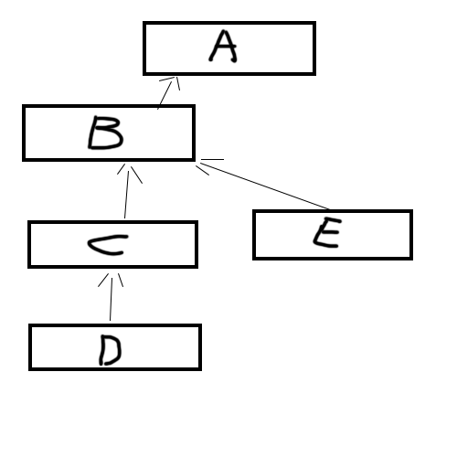

多态
======
接下来，开始探索多态王国吧！💖


初识多态
-----
这一小节中，我们将阐述多态的概念。若大家觉得有些晦涩，也没有关系，可以边看边思考。在有了这一小节的初步印象后，下一小节将会帮助大家更好地理解多态的概念。

多态(Polymorphism)是Java面向对象编程中非常重要的一个概念。多态，原本指的是在生物学中，一个生物体或物种，可以有不同的形态或发育阶段（例如蝴蝶的变态）。**在Java中，多态指的是，同一个方法具有多个不同表现形式或形态的能力。**
多态的好处是，可以使程序有良好的扩展，并可以对所有类的对象进行通用处理。

多态的概念，与前一节我们讲过的`方法重写`有着紧密的关联。一个至少在一个子类中被重写过的方法，就被称为是多态的方法。

对于被重写过的方法，它们都具有相同的方法名。那么Java在运行的时候，该如何是好？Java是依靠什么机制，来选择具体要执行哪一个方法的呢？

**在Java中，方法调用总是由调用这一方法的对象实际指向的对象类型（也就是在`new`语句后紧跟着的类型），而不是由这一对象引用的对象类型（也就是在`new`语句中，实际对象前面的那个类型）来决定的。**


例如，在语句
```javav
Animal puppy = new Dog();
```
中，实例对象`puppy`所引用的类型是`Animal`，而其实际指向的类型则是`Dog`。

这个机制，就叫做多态。

**多态是一个为处在类继承层次结构中的特定对象，选择适当的方法的机制。**

来给大家举一个例子。这个例子比较长，但在其后有详细的解释，不要慌！
```java
public class Bicycle {

    // 这个自行车有三个属性
    public int cadence;
    public int gear;
    public int speed;

    // 这个自行车类有一个构造方法
    public Bicycle(int startCadence, int startSpeed, int startGear) {
        gear = startGear;
        cadence = startCadence;
        speed = startSpeed;
    }

    public void printDescription(){
        System.out.println("\nBike is " + "in gear " + this.gear
        + " with a cadence of " + this.cadence +
        " and travelling at a speed of " + this.speed + ". ");
    }
}

public class MountainBike extends Bicycle {
    private String suspension;

    public MountainBike(
               int startCadence,
               int startSpeed,
               int startGear,
               String suspensionType){
    }

    public void printDescription() {
        super.printDescription();
        System.out.println("The " + "MountainBike has a" +
            getSuspension() + " suspension.");
    }
}


public class RoadBike extends Bicycle{
    private int tireWidth;

    public RoadBike(int startCadence,
                    int startSpeed,
                    int startGear,
                    int newTireWidth){
    }

    public void printDescription(){
        super.printDescription();
        System.out.println("The RoadBike" + " has " + getTireWidth() +
            " MM tires.");
    }
}

public class TestBikes {
  public static void main(String[] args){
    Bicycle bike01, bike02, bike03;

    bike01 = new Bicycle(20, 10, 1);
    bike02 = new MountainBike(20, 10, 5, "Dual");
    bike03 = new RoadBike(40, 20, 8, 23);

    bike01.printDescription();
    bike02.printDescription();
    bike03.printDescription();
  }
}
```

下面进行拆分解释。首先，如下是我们在上一节中见过的Bicycle类，为了展示多态，我们引入一个方法`printDescription`，来展示一个对象（自行车）的所有当前属性。最终`Bicycle`类为如下：
```java
public class Bicycle {

    // 这个自行车有三个属性
    public int cadence;
    public int gear;
    public int speed;

    // 这个自行车类有一个构造方法
    public Bicycle(int startCadence, int startSpeed, int startGear) {
        gear = startGear;
        cadence = startCadence;
        speed = startSpeed;
    }

    public void printDescription(){
        System.out.println("\nBike is " + "in gear " + this.gear
        + " with a cadence of " + this.cadence +
        " and travelling at a speed of " + this.speed + ". ");
}
}
```


为了展示多态，我们由`Bicycle`类派生出`MountainBike`类与`RoadBike`类，并在二者中重写`printDescription`方法。

在`MountainBike`类中，我们引入一个新的属性：`suspension`，来描述山地自行车的悬挂缓冲系统（描述这辆车是否有一个前缓冲系统`Front`，或有一个前缓冲系统和一个后缓冲系统`Dual`）.
```java
public class MountainBike extends Bicycle {
    private String suspension;

    public MountainBike(
               int startCadence,
               int startSpeed,
               int startGear,
               String suspensionType){
    }

    public void printDescription() {
        super.printDescription();
        System.out.println("The " + "MountainBike has a" +
            getSuspension() + " suspension.");
    }
}

```
请注意重写的`printDescription`方法。 除了之前提供的信息之外，输出中还包括有关悬挂缓冲系统的其他信息。

接下来，创建`RoadBike`类。 由于公路赛车或赛车有较细窄的轮胎，因此我们添加一个属性`tireWidth`来描述轮胎宽度。
```java
public class RoadBike extends Bicycle{
    private int tireWidth;

    public RoadBike(int startCadence,
                    int startSpeed,
                    int startGear,
                    int newTireWidth){
    }

    public void printDescription(){
        super.printDescription();
        System.out.println("The RoadBike" + " has " + getTireWidth() +
            " MM tires.");
    }
}
```
请注意，`printDescription`方法再次被重写。 除了`Bicycle`具有的属性外，这里还显示有关轮胎宽度的信息。

总而言之，我们有三类：父类`Bicycle`，以及并列的子类`MountainBike`和`RoadBike`。 这两个子类重写`printDescription`方法并打印各自不同的信息。

接着，我们写一个`TestBikes`类进行测试。
```java
public class TestBikes {
  public static void main(String[] args){
    Bicycle bike01, bike02, bike03;

    bike01 = new Bicycle(20, 10, 1);
    bike02 = new MountainBike(20, 10, 5, "Dual");
    bike03 = new RoadBike(40, 20, 8, 23);

    bike01.printDescription();
    bike02.printDescription();
    bike03.printDescription();
  }
}
```
则运行结果为：
```
Bike is in gear 1 with a cadence of 20 and travelling at a speed of 10.

Bike is in gear 5 with a cadence of 20 and travelling at a speed of 10.
The MountainBike has a Dual suspension.

Bike is in gear 8 with a cadence of 40 and travelling at a speed of 20.
The RoadBike has 23 MM tires.
```

**如前所述，在Java中，方法调用总是由实际对象的类型决定的，而不是由对象引用的类型决定的。**


**在这个例子中，对象`bike01`, `bike02`, `bike03`所引用的类型都是`Bicycle`类，但他们实际所指的对象类型，则分别是`Bicycle`, `MountainBike`, `RoadBike`。**


可见，虽然我们有多个`printDescription`方法，但Java虚拟机（JVM）会为每个对象调用适当的方法。

是不是还是有点晕乎乎的呢？接下来的讲解会让大家更为明晰。💖

再谈多态
-----
我们前文讲到
```
在Java中，方法调用总是由实际对象指向的类型决定的，而不是由对象引用的类型决定的。

对象bike01, bike02, bike03所引用的类型都是Bicycle类，但他们实际所指的对象类型，则分别是Bicycle, MountainBike, RoadBike。
```
还记得吗？多态指的是一种，为，处在类继承层次结构（也就是一层一层的，从高到低的这种继承关系，一级一级的结构）中的具体对象（一个特定对象，处在类继承层次结构中特定的某一级别、某一层次）选择适当的方法的机制。比如我们在前面的例子中，我们的三个bike对象，分别处在三个不同的层次（一个在父类，两个在子类），然后，我们分别让这三个bike对象，调用了同一个方法名的方法`printDescription`。但是，同一个方法名的方法`printDescription`，实际上有三种不同的形态：`普通自行车(Bicycle)`形态，`山地自行车(MountainBike)`形态，以及`公路自行车(RoadBike)`形态。也就是说，这个`printDescription`方法，是具有多种形态的！`printDescription`这一个被两次重写过的方法，就被称为是多态的方法。

那么，当Java程序在执行时，具体执行`printDescription`这一多态方法的哪一种形态，则取决于，调用这一方法的对象，实际**指向**的对象类型（也就是在`new`语句后紧跟着的类型），而不是这一对象**引用**的对象类型（也就是在`new`语句中，实际对象前面的那个类型
）。例如，在语句
```java
Animal puppy = new Dog();
```
中，实例对象`puppy`所引用的类型是`Animal`，而其实际指向的类型则是`Dog`。

再拿`代欧奇希斯`这只神奇宝贝来作个比喻：这是一种长得像外星人的两足神奇宝贝，拥有四种形态，各自注重不同的能力。但，这四种形都态具有共同特征，其躯体都为橘红色，面部都为蓝绿色，背部都有三个蓝绿色的点。


方法的多态性也就像这样，同一个行为具有多个不同表现形式或形态的能力。就如同蝴蝶拥有许多不同的发展形态一样。

让我们回到我们的自行车例子（不要跑偏到神奇宝贝了），来说明多态的存在，所需要的三个前提：

**1. 存在继承关系**

    `MountainBike`类与`RoadBike`类继承了`Bicycle`类。

**2. 子类要重写父类的方法**

    子类重写（Override)了父类的实例方法`printDescription`

**3. 对父类的引用指向子类对象**

测试类`TestBikes`中，语句

```java
Bicycle bike01, bike02, bike03;

bike01 = new Bicycle(20, 10, 1);
bike02 = new MountainBike(20, 10, 5, "Dual");
bike03 = new RoadBike(40, 20, 8, 23);
```
将对于父类`Bicycle`的引用，指向了`Bicycle`, `MountainBike`, `RoadBike`这三个子类对象。


类型转换
-----

在AP CS A中，我们只需要掌握 **向下转型（downcasting）** 的概念。


考虑如下代码：
```java
//假设getID()方法是GradStudent类中特有的一个public实例方法，没有在Student类中被定义，GradStudent类继承自Student类。
Student student = new GradStudent();
GradStudent gradstudent = new GradStudent();
int x = student.getID(); //编译时错误
int y = gradstudent.getID(); //正确
```

我们可以看到，`student`与`gradstudent`两个实例对象，明明都指向着`GradStudent`这个类，为何
```java
student.getID()
```
会报错呢？

这是因为，尽管实例对象`student`实际指向的是`GradStudent`这个类，但其引用类型仍然为`Student`类，而`Student`类是没有定义一个`getID()`方法的。在编译时，只有`Student`类的非`private`类型的方法，才能使用点号运算符`.`应用于`student`对象。注意，这和我们之前提到的`多态`无关，因为它不满足我们讲过的，`多态`所应该具备的条件：我们没有为子类`GradStudent`重写过getID()方法。因此，这里的`getID()`方法，我们没有赋予它多态性。是故，其只能被用于`GradStudent`类中的实例对象。

那么，如果我们很需要为`student`对象使用`getID()`方法，怎么办呢？

我们可以对`student`对象进行`转型(casting)`，将其强行转为正确的引用类型：
```java
 int x = ((GradStudent) student).getID();
```

因为`student`本已是一个指向`GradStudent`类的对象，只不过其引用对象仍为`Student`，我们的转型可以顺利完成。

像这样的，把一个子类引用指向父类对象的转型过程，称作`向下转型`。

在这个例子中，子类引用就是子类`GradStudent`中的引用方法`getID()`，我们将其强行指向父类对象`student`，使之能够被`student`对象合法地调用。

动态绑定
-----
动态绑定（Dynamic bonding)，指的是，当存在方法重写时，关于调用哪一个实例方法的决定，是在Java程序运行时(run-time)（Java虚拟机JVM实时解析运行Java字节码时）才实时作出的。也就是说，这一个决定是在程序运行时，才实时、动态地作出的。

与之相对的是，当存在方法重载时，关于调用哪一个实例方法的决定，是在Java程序编译时(compile-time)就已经做好的、固化了的，一成不变的的决定，这一种类型被称为静态绑定(Static bonding)。

在静态绑定中，编译器会通过分析比较实例方法的签名特点、逻辑层次归属等等，来选择正确的方法重载，并且一旦选择完毕，就在编译时将这样的绑定关系定死了，不可能再改变了。

而在多态的实现中，当遭遇到方法重写，最终哪一个实例方法会被调用这个决定，不是由编译器在编译时决定的。

在动态绑定的过程中，编译器所做的事情是，判断一个方法能否被合法地调用。而，运行时环境（Java虚拟机JVM）才是最终作出关于究竟要调用被重写的方法中的哪一个实例方法的决定的那个角色。
来看下面这个例子：


当这一段代码在运行的时候，`speak()`方法的具体选择，会根据调用该方法的具体对象类型而定。

再来看巴朗教材中的一段例子：
```java
public class StudentTest
{
public static void computeAllGrades(Student[] studentList)
{
for (Student s : studentList)
if (s != null)
s.computeGrade();
}
public static void main(String[] args)
{
Student[] stu = new Student[5];
stu[0] = new Student("Brian Lorenzen",
new int[] {90,94,99}, "none");
stu[1] = new UnderGrad("Tim Broder",
new int[] {90,90,100}, "none");
stu[2] = new GradStudent("Kevin Cristella",
new int[] {85,70,90}, "none", 1234);
computeAllGrades(stu);
}
}
```
这里我们创建了一个包含长度为`5`的`Student`数组，它们最初都是都是空的。 其中的三个数组对象`stu[0]`, `stu[1]`, `stu[2]`，接着被指向三个具体的实例对象。

`computeAllGrades`方法遍历数组，为每个对象调用相应的`computeGrade`方法，在每种情况下都使用动态绑定。 对`computeAllGrades`方法进行空测试是必需的，因为某些数组引用可能为空。

使用“super”调用父类
-----
使用`super`关键字，我们能够使得一个子类，调用处在其父类中的一个方法。大家可能会感到疑惑，我们前面不是讲到，一个子类继承了父类以后，这个子类就继承分享了，其父类的属性和方法了吗？比如，
```java
public class Mammal{
    public void eat(){
        System.out.println("I can eat!");
    }
}

public class Dog extends Mammal{
    public static void main(String[] args){
        Dog puppy = new Dog();
        puppy.eat();
    }
}
```
在上述代码中，我们不用`super`关键字，就可以使用父类中的`eat()`方法。那么，`super`关键字在什么时候会派上用场呢？

答案是：当出现方法重写时。

**如果在子类中，我们对一个方法进行了重写，则重写过的方法默认覆盖过了父类中的同名方法，但若我们就是想使用父类中的，被重写过的，那一个原本的方法，那我们就可以通过使用关键字`super`来调用被重写过(Overridden)的方法。**

比方说：
```java
public class Superclass {

    public void printMethod() {
        System.out.println("Printed in Superclass.");
    }
}

public class Subclass extends Superclass {

    // overrides printMethod in Superclass
    public void printMethod() {
        super.printMethod();
        System.out.println("Printed in Subclass.");
    }
    public static void main(String[] args) {
        Subclass s = new Subclass();
        s.printMethod();    
    }
}
```
在这个例子中，我们的`printMethod`在子类`Subclass`中被重写过了一次。如果我们像前面`Dog`类那个例子一样，仅仅使用点号运算符`.`在子类中去调用这个，则根据我们在`方法重写`那一章节讲的规则，Java程序默认会选择使用重写过的方法，也就是子类中的那一个`printMethod`方法，而非父类中原本的`printMethod`方法。因此，若我们想要在子类中使用父类中的`printMethod`方法，而非子类中的`printMethod`方法，我们必须使用`super`进行强行声明。

上述程序的运行结果为:
```
Printed in Superclass.
Printed in Subclass.
```

原因是，Java程序首先从子类`Subclass`中的`main()`方法开始执行，实例对象`s`将会优先调用子类中的`printMethod()`方法，在这个方法中有两行语句。第一行语句
```java
super.printMethod();
```
中的`super`关键字，将会强行声明，我们这里要使用的是父类中的`printMethod`方法，于是Java运行环境（Java虚拟机JVM）将会去试图寻找并执行类继承层次结构上，这个子类上一级别的父类中的`printMethod`方法，于是，这一行语句调用了父类`Superclass`中的`printMethod`方法，打印出第一行结果：
```
Printed in Superclass.
```
注意，这里其实是在执行子类中的`printMethod()`方法，只不过在执行的过程中，`super`关键字使得程序流程"灵魂出窍"一样，暂时去了更高一个类，执行完这一行语句后，Java虚拟机JVM紧接着执行的仍然是子类中的`printMethod()`方法  的下一行语句
```java
System.out.println("Printed in Subclass.");
```
打印出第二行结果：
```
Printed in Subclass.
```

“super”与构造方法
-----
构造方法是永远不会被继承的！ 如果我们没有显式地为子类编写构造函数，Java虚拟机JVM会为子类自动生成不带参数的默认构造函数。

`super`关键字还可以被用于在子类中调用(invoke)父类中的构造方法(constructor)。回想一下我们前面提过的`Bicycle`类的例子，在那个例子中，`MountainBike`类是`Bicycle`类的子类。

下面这段代码展示的是在那个例子中，子类`MountainBike`中的构造方法，通过`super`关键字，调用了父类的构造方法。

```java
public MountainBike(int startHeight, int startCadence, int startSpeed, int startGear)
{
    super(startCadence, startSpeed, startGear);
}  
```

在子类中使用`super`调用父类中的构造方法的语法是:
```java
super();  
```

或：

```java
super(parameter1, parameter2, ...）;
```

若使用`super();`, 父类中不带传入参数列表的构造方法将会被调用。当使用带传入参数的 `super`关键字，例如
```java
super(parameter1, parameter2, ...);
```
则父类中具有匹配的传入参数列表的构造函数将会被调用。

**注意：**Java里有一个特殊要求，就是我们在构造器里面调用`super()`的时候，`super()`必须要**在构造器里的第一行**。比如这个类里面的构造器是可以编译的：
```java
public class SavingsAccount extends BankAccount {
    private double interestRate;
    public SavingsAccount() {
        super();
        interestRate = 0;
    }
}
```
而这个类里的构造器不行：
```java
public class SavingsAccount extends BankAccount {
    private double interestRate;
    public SavingsAccount() {
        interestRate = 0;
        super();
    }
}
```

考试技巧
-----
ClassCastException出现情况&Downcasting可以发生的情况。
```java
class a{
}
class b extends a{
}
class c extends b{
}
class e extends b{
}
class d extends c{
}

a x =new d()
//(b)x,(c)x,(d)x 都可以
//(e)x 会出现ClassCastException错误 
b x = new c()
// (d)x, (a)x 会出现ClassCastException错误
a x = new e()
//(b)x,(e)x 都可以
//其他如(d)x会出现ClassCastException错误 
````
也就是说在转换类型的时候, 继承关系是 a <- b <- c <- d & b <- e

(下面的O,P,I 都代表一个不同的类名)

那么 在使用 `O x = new P();` (O,P 是a到d那一条继承关系链中的一种(e不能包括,因为d没有继承e) 且 O>=P)

downcasting向下转换 `(I) x;` 只有在 P <= I <= O 时不会出错，反之会抛出 ClassCastException 错误。


小练习
-----
**Answering question 1 requires you to read the following code:**

```java
public class BankAccount {
    private double balance;
    public BankAccount() {
        balance = 0;
    }
    public BankAccount(double acctBalance) {
        balance = acctBalance;
    }
    public void deposit(double amount) {
        balance += amount;
    }
    public void withdraw(double amount) {
        balance -= amount;
    }
    public double getBalance() {
        return balance;
    }
}
public class SavingsAccount extends BankAccount {
    private double interestRate;
    public SavingsAccount() {
        /* implementation not shown */
    }
    public SavingsAccount(double acctBalance, double rate) {
        /* implementation not shown */
    }
    public void addInterest() //Add interest to balance
    {
        /* implementation not shown */
    }
}
```

1.Which of the following correctly implements the default constructor of the `SavingsAccount` class?

I interestRate = 0;
super();

II super();
interestRate = 0;

III super();

(A) II

(B) I and II only

(C) II and III only

(D) III only

(E) I, II, and III

<cr type="hidden"><notice>隐藏内容功能在此无法正常显示，请移步至[程谱 coderecipe.cn](https://coderecipe.cn/learn/3)查看。</notice>C

解析：这道题的考点是一个特殊情况，就是`super()`无论如何要在构造器的第一行，因此I是不行的，III看起来不行（没有初始化`interestRate`），但实际上，因为`interestRate`是一个`double`类型的变量，它会有默认值`0.0`，因此不初始化也可以的（如果这个变量是引用类型，这个变量的值就会是`null`）。</cr>

2.【2014年AP CS第22题】

Consider the following Book and AudioBook classes.

```java
public class Book
{
  private int numPages;
  private String bookTitle;

  public Book(int pages. String title)
  {
  numPages = pages;
  bookTitle = title;
  }

  public String toStringO
  {
    return bookTitle + " " + numPages;
  }

  public int length()
  {
    return numPages;
  }
}


public class AudioBook extends Book
{
  private int numMinutes;
  public AudioBook(int minutes, int pages. String title)
  {
    super(pages, title); numMinutes = minutes;
  }

  public int length()
  {
    return numMinutes;
  }

  public double pagesPerMinute()
  {
    return ((double) super.length()) / numMinutes;
  }
}
```

Consider the following code segment that appears in a class other than Book or AudioBook.

```java
Line1: Book[] books = new Book[2];
Line2: books[0] = new AudioBook(100, 300, "the Jungle");
Line3: books[1] = new Book(400, "Captains Courageous");
Line4: System.out.println(books[0].pagesPerMinute());
Line5: System.out.println(books[0].toString());
Line6: System.out.println(books[0].length());
Line7: System.out.println(books[1].toString());
```

Which of the following best explains why the code segment will not compile?

(A) Line 2 will not compile because variables of type Book may not refer to variables of type AudioBook

(B) Line 4 will not compile because variables of type Book may only call methods in the Book cl

(C) Line 5 will not compile because the AudioBook class does not have a method named toString declared or implemented.

(D) Line 6 will not compile because the statement is ambiguous. The compiler cannot determine which
length method should be called.

(E) Line 7 will not compile because the element at index 1 in the array named books may not have been
initialized.


<cr type="hidden"><notice>隐藏内容功能在此无法正常显示，请移步至[程谱 coderecipe.cn](https://coderecipe.cn/learn/3)查看。</notice>B</cr>

A program to test the BankAccount, SavingsAccount, and CheckingAccount classes has
these declarations:
```java
BankAccount b = new BankAccount(1400);

BankAccount s = new SavingsAccount(1000, 0.04);

BankAccount c = new CheckingAccount(500);
```

3.Which method call will cause an error?

(A) b.deposit(200);

(B) s.withdraw(500);

(C) c.withdraw(500);

(D) s.deposit(10000);

(E) s.addInterest();

4.In order to test polymorphism, which method must be used in the program?

(A) Either a SavingsAccount constructor or a CheckingAccount constructor

(B) addInterest

(C) deposit

(D) withdraw

(E) getBalance

Multiple-Choice Questions on Inheritance and Polymorphism 153

5.Which of the following will not cause a ClassCastException to be thrown?

(A) ((SavingsAccount) b).addInterest();

(B) ((CheckingAccount) b).withdraw(200);

(C) ((CheckingAccount) c).deposit(800);

(D) ((CheckingAccount) s).withdraw(150);

(E) ((SavingsAccount) c).addInterest();

<cr type="hidden"><notice>隐藏内容功能在此无法正常显示，请移步至[程谱 coderecipe.cn](https://coderecipe.cn/learn/3)查看。</notice>E, D, C</cr>
### 实验室

在这里练习吧：
<lab lang="java" parameters="filename=Hello.java">
<notice>练习环境在此无法显示，请移步至[程谱 coderecipe.cn](https://coderecipe.cn/learn/3)查看。</notice>
public class Hello {
   public static void main(String[] args) {
     // 在这里添加你的代码
   }
}
</lab>
