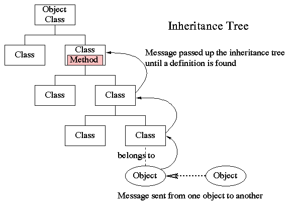

最终超类——Object类
=====
哈哈，祝贺大家！在前几个章节中我们已经攻克了AP所涉及的Java面向对象编程中，最难啃的几个概念。这一章节与下一章节，我们将进行收尾。请大家不要急躁，马上，我们就完成所有章节的攻克啦！

Object类是什么
-----
我们在`继承`章节中讲过，在Java中，除了最终超类：`Object`类，所有的类都有且仅有一个直接的父类（这被称为单继承）。当没有明确在程序中声明某些类所属的父类时，这些类都是最终超类：`Object`类的（隐式）子类。

那么，`Object`类，就是Java世界中，处在类继承层次结构上的最高层次的那一个类，也叫作最终超类(ultimate superclass)。`Object`类是一个普通的类，而非抽象类。

在Java中，所有的类都被规定为继承自`Object`类，也就是说，`Object`类是所有类的直接或间接父类。



Object类里的方法
-----
在`Object`类中有许多内置的方法。这些方法都被所有其他的类自动继承。`Object`类是一个普通的类，而非抽象类。因此，`Object`类中所有的方法都是带有具体实现的实例方法。在写程序时，你完全可以选择不去使用`Object`类中的任何内置方法。但是，如果你选择去使用它们，你可能会需要在子类中带有特定目的性地重写这些方法，使得这些方法更贴合你的子类。

在AP考试中，我们需要掌握两个`Object`类中的内置方法：`toString()`方法，以及`equals()`方法。

### `toString()` 方法
`toString()`方法的具体实现语句如下：
```java
public String toString()
```
这是一个`public`的，返回值为`String`型的方法。

这个方法的作用是，以`String`类型，返回调用这个方法"想要返回的"信息，这个信息作为`toString()`方法的返回值，也作为调用这个方法的对象的一个`String`类型的属性，最后，我们通常使用`System.out.println(对象名)`来打印出`toString()`方法返回的信息。也就是说，当你编写一段程序时，在一段方法的行为执行过程中，你可能会希望这个方法以字符串的形式返回一个信息（比如一句话）。例如，在一个改变银行账户余额的行为中，你可能会想让这个方法返回一个当前账户余额的信息。这个时候，你就可以使用`toString()`方法。也就是说，想让`toString()`方法返回什么样的信息，完全取决于编程者的意愿，完全取决于是什么样的一个具体对象调用了这个方法，取决于这一个调用它的对象想要返回什么信息。而，每一段程序，每一个对象想要做的事情都迥然不同，而`toString()`方法却是所有类都继承的、处在最终超类`Object`中的一个方法。显然，如果直接继承使用（而不加重写）这一个方法，根本不能满足每一个特定的类中的特定的对象的特定要求。因此，我们应该总是考虑在每一个需要使用`toString()`的方法中重写`toString()`方法。

如果我们直接使用`Object`类中的`toString()`而未进行重写，我们将得到`toString()`方法所在的类名加上一串数字（调用`toString()`类的对象的内存地址）。例如：
```Java
ExampleClass o = new ExampleClass;
System.out.println(o);
```
调用了继承自`Object`类的`toString()`方法，其结果可能为
```
ExampleClass@bbf326d7
```
这通常不是我们想要的结果（除非你的目的是知道对象的内存地址）。因此我们应该总是考虑在具体的类中重写`toString()`方法。

例如，我们想让一个方法能够返回一句话，来表述库存的书的数目：

```Java
public class Book{
    int BookVolume = 500;
    public String toString(){
        return "The number of book is " + BookVolume + ".";
    }

    public static void main(String[] args){
        Book b = new Book();
        System.out.println(b);
    }
}
```
会如我们所愿地输出结果:
```
The number of book is 500.
```

注意：
`toString()`方法是不适用于数组对象(array object)的。 若要打印出数组的元素，我们必须遍历数组的每一个元素，并明确地一个一个打印出这些元素的信息。

### `equals()` 方法
相等的意义要视对象的类型而定。

举例来说，如果两个不同的作为原始数据类型的`String`类型的变量带有相同的字符，它们在涵义上是相等的，因为`String`作为原始类型，也只与涵义有关，不存在引用的概念，因此，这两个`String`类型的变量就可以说是完全相等了。

很多时候，我们想要知道两个原始数据类型(primitive type)是否相等。这个时候很简单，只要使用`==`这个运算符就可以。例如：
```java
int a = 3;
byte b = 3;
System.out.println(if(a==b));
```
返回`true`

有时你想要知道两个引用类型的变量（比如类）在是否引用到（指向）同一个对象。这也很容易，也是使用`==`运算符。例如：
```java
Date d1 = new Date("March", 2, 2018);
Date d2 = d1;
Date d3 = new Date("March", 2, 2018);
System.out.println(if(d1==d3));
```
将会返回`false`，因为`d1`与`d3`并非指向同一个对象：一个叫`d1`，一个叫`d2`，这是内存上占用两个不同内存地址的两个独立对象。

也就是说，对于原始数据类型的变量，`==`仅仅比较两个变量是否具有相同的字节。对于引用数据类型的变量，`==`仅仅比较两个变量是否指向同一个对象。

但是，有时，你会需要知道两个对象在实际意义上（也就是对象所包含的值）是否真的相等。此时你就得使用`equals()`这个方法。例如：
```java
Date d1 = new Date("March", 2, 2018);
Date d2 = d1;
Date d3 = new Date("March", 2, 2018);
System.out.println(d1.equals(d3));
```
将返回`true`，因为，尽管`d1`与`d2`在引用上不相同（二者指向不同的对象，一个是`d1`，一个是`d2`），但二者的**内容**是一样的，都是同一个日期。

小练习
-----
Consider the code fragment
```java
Object intObj = new Integer(9);
System.out.println((String) intObj);
```
What will be output as a result of running the fragment?

(A) No output. A ClassCastExceptionwill be thrown.

(B) No output. An ArithmeticExceptionwill be thrown.

(C) 9

(D) "9"

(E) nine

<cr type="hidden"><notice>隐藏内容功能在此无法正常显示，请移步至[程谱 coderecipe.cn](https://coderecipe.cn/learn/3)查看。</notice>A</cr>
### 实验室

在这里练习吧：
<lab lang="java" parameters="filename=Hello.java">
<notice>练习环境在此无法显示，请移步至[程谱 coderecipe.cn](https://coderecipe.cn/learn/3)查看。</notice>
public class Hello {
   public static void main(String[] args) {
     // 在这里添加你的代码
   }
}
</lab>
